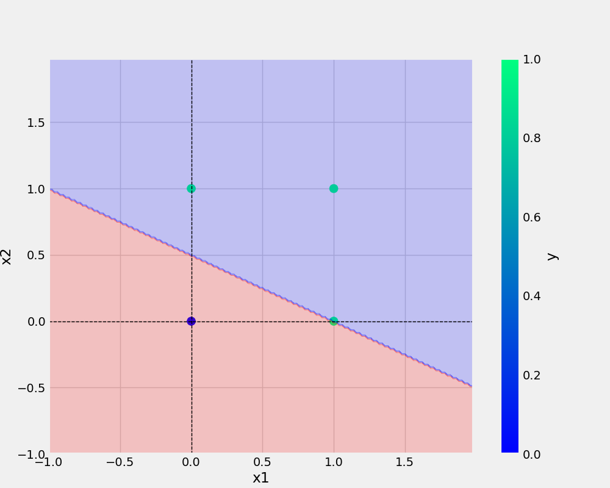

# ineuron_learning

# commands

```bash
git add . && git commit -m "docstring update" && git push origin main
```

```bash
cp Research\ notebooks/demo.ipynb .
```

## Add image


<a href="https://www.w3schools.com">Visit W3Schools.com!</a>


