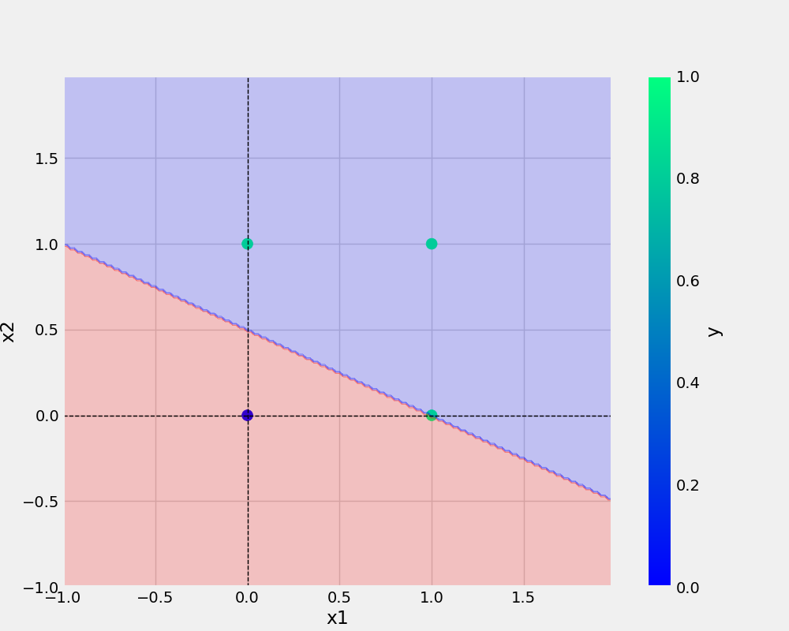

# ineuron_learning

# commands

```bash
git add . && git commit -m "docstring update" && git push origin main
```

```bash
cp Research\ notebooks/demo.ipynb .
```

## Add image


# anchor tag
<a href="https://www.w3schools.com">Visit W3Schools.com!</a>

# image tag


## python code
``` python 
try:
        logging.info(">>>>> starting training >>>>>")
        main(data=OR, modelName="or.model", plotName="or.png", eta=ETA, epochs=EPOCHS)
        logging.info("<<<<< training done successfully<<<<<\n")
    except Exception as e:
        logging.exception(e)
        raise e
```

## dataset
x1 | x1 | y
-|-|-
0|0|0
0|1|1
1|0|1
1|1|1

## points
* point 1
1. point one


